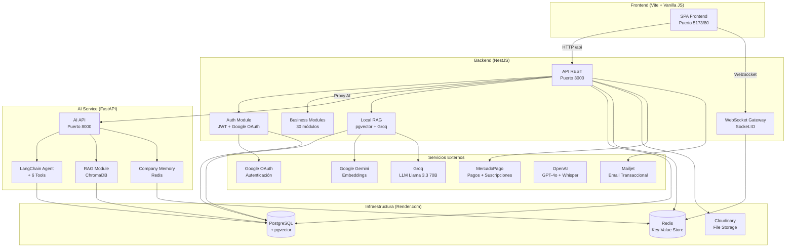
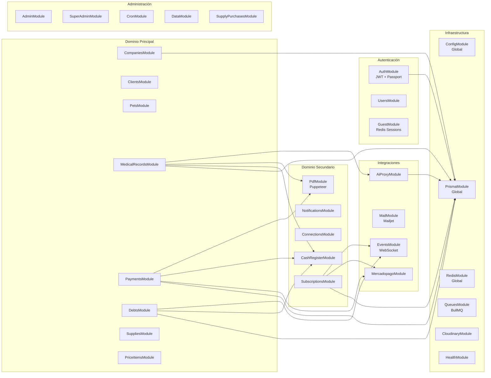
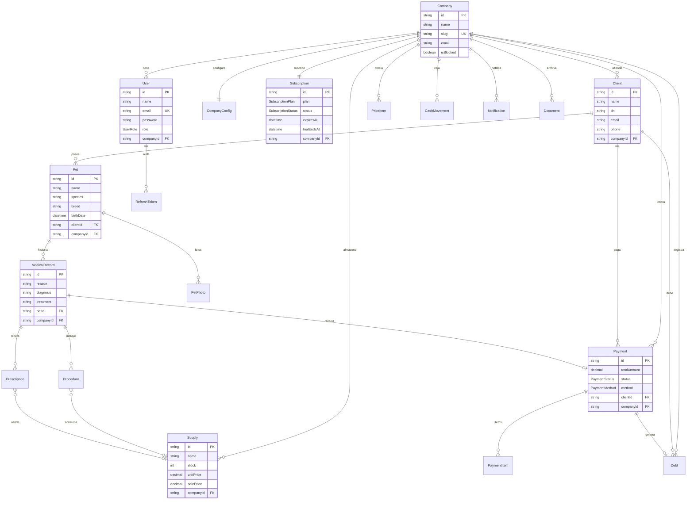
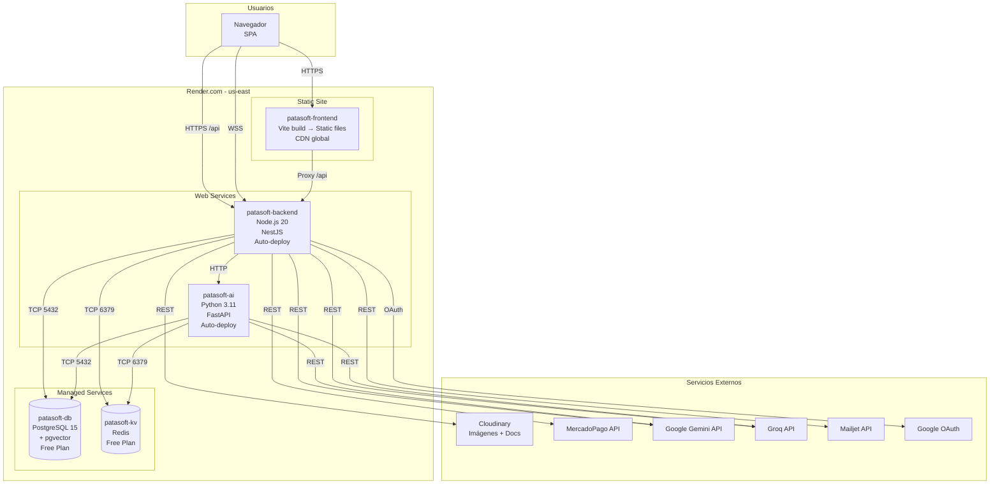

# PataSoft - Arquitectura del Sistema

## Diagrama de Componentes del Sistema

## Diagrama de Módulos del Backend (NestJS)

## Diagrama ER Simplificado (Prisma)

## Diagrama de Despliegue (Render.com)

## Stack Tecnológico

| Capa | Tecnología | Versión | Razón |
|------|-----------|---------|-------|
| **Frontend** | Vite + Vanilla JS | 5.4 | Simplicidad, sin curva de aprendizaje |
| **Backend** | NestJS + TypeScript | 10.x | Modularidad, enterprise-ready |
| **ORM** | Prisma | 5.22 | Type-safety, migraciones automáticas |
| **Base de datos** | PostgreSQL + pgvector | 15+ | Relacional + vectores para RAG |
| **Cache** | Redis | 7+ | Sesiones, cache de suscripción |
| **AI Service** | FastAPI + Python | 0.115 | Ecosistema LangChain, ML |
| **LLM** | Groq (Llama 3.3 70B) | - | Velocidad, costo cero |
| **Embeddings** | Google Gemini | - | 768 dimensiones, buen rendimiento |
| **Pagos** | MercadoPago | 2.12 | Mercado argentino, QR, checkout |
| **Email** | Mailjet | 6.x | Transaccional, templates |
| **Storage** | Cloudinary | 2.9 | Imágenes, PDFs, raw files |
| **Auth** | JWT + Passport | - | Access + Refresh tokens |
| **WebSockets** | Socket.IO | 4.8 | Tiempo real, notificaciones |
| **PDF** | Puppeteer + Handlebars | 22.x | Generación server-side |
| **Hosting** | Render.com | - | Free tier, auto-deploy |

### Organización de módulos (AppModule)

AppModule agrupa los módulos en capas:

**Infraestructura:** PrismaModule, RedisModule, QueuesModule, HealthModule

**Auth y Usuarios:** AuthModule, UsersModule, SubscriptionsModule, GuestModule

**Admin:** AdminModule, SuperAdminModule

**Dominio veterinario (VeterinaryModule):**
  CompaniesModule, ClientsModule, PetsModule, MedicalRecordsModule,
  PdfModule, PaymentsModule, DebtsModule, SuppliesModule,
  PriceItemsModule, CashRegisterModule, SupplyPurchasesModule, NotificationsModule

**Integraciones (IntegrationsModule):**
  CloudinaryModule, MercadopagoModule, MailModule,
  ConnectionsModule, AiProxyModule, EventsModule

**Soporte:** CronModule, DataModule

### Estructura de archivos y tipos

- **Shared Types:** `shared/src/types/` contiene tipos compartidos entre frontend y backend.
- **Response DTOs:** `backend/src/common/dto/response.dto.ts` define los objetos de respuesta estandarizados para la API (Swagger-ready).
- **Frontend Utilities:** `frontend/src/utils/` contiene helpers para sanitización, formateo y validación.

## Deuda Técnica y Roadmap (v1.1.0)

PataSoft reconoce los siguientes puntos de deuda técnica que serán abordados en el primer release mayor post-lanzamiento (v1.1.0):

### 1. Desacoplamiento de Módulos (Anti-patrón Circular)
Actualmente existen dependencias circulares (ej: `AiProxy` ↔ `Queues`) resueltas mediante `forwardRef`.
- **Plan:** Migrar a una arquitectura orientada a eventos usando `EventEmitter2` para desacoplar el procesamiento de documentos de la lógica de negocio de IA.

### 2. Serialización Estricta de Salida
Aunque se han implementado Response DTOs en los controladores principales, el sistema aún depende en parte de los tipos generados por Prisma.
- **Plan:** Implementar interceptores de serialización globales para asegurar que ninguna propiedad interna de la DB (como `password` o metadatos de sistema) se escape en las respuestas de la API.

### 3. Migración a Cookies httpOnly
Actualmente el Refresh Token reside en `localStorage`.
- **Plan:** Migrar el almacenamiento de tokens a cookies `httpOnly` y `Secure` para mitigar riesgos de ataques XSS.

