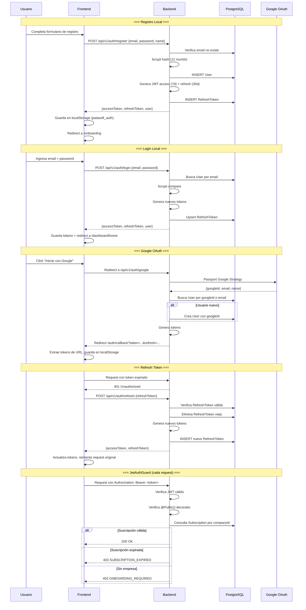
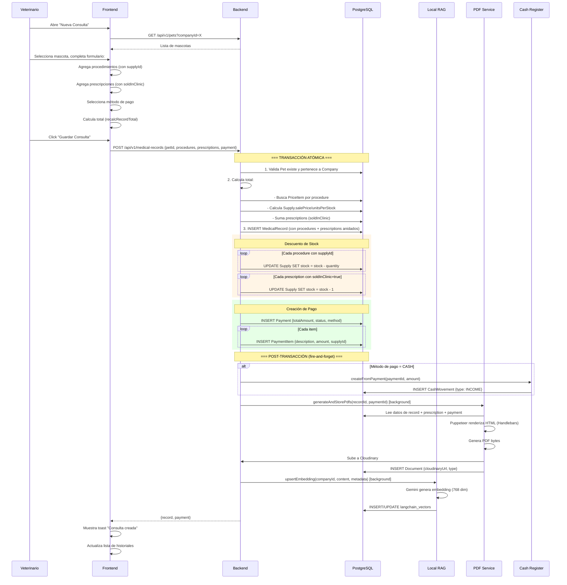
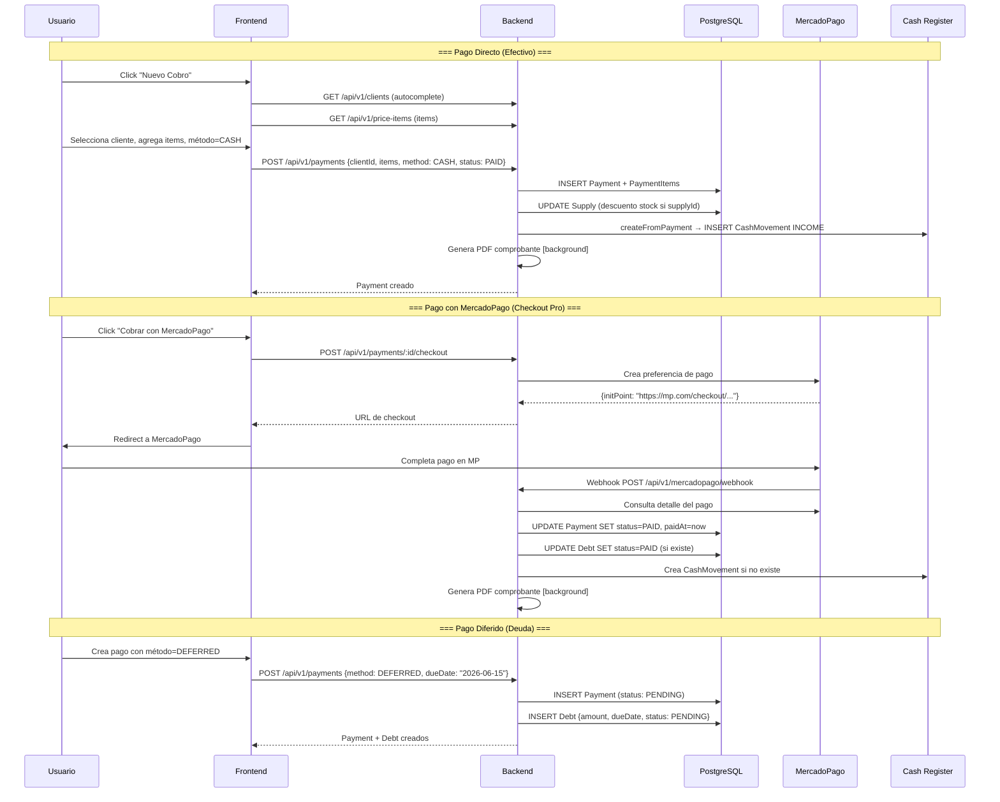
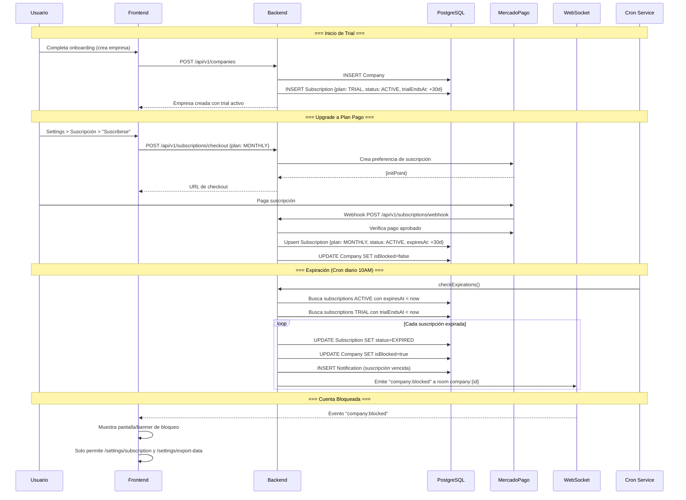
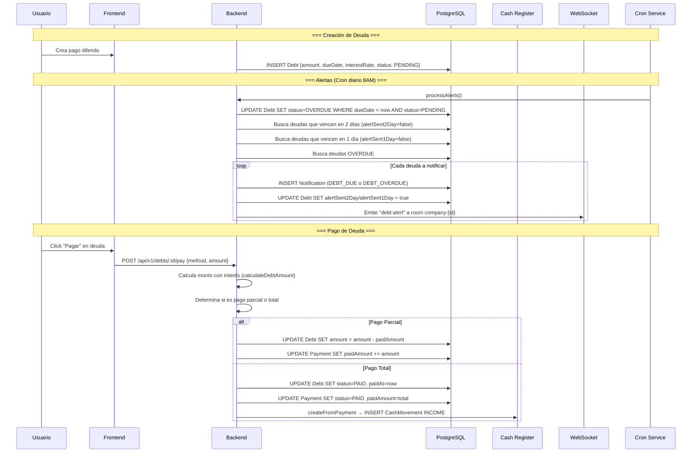
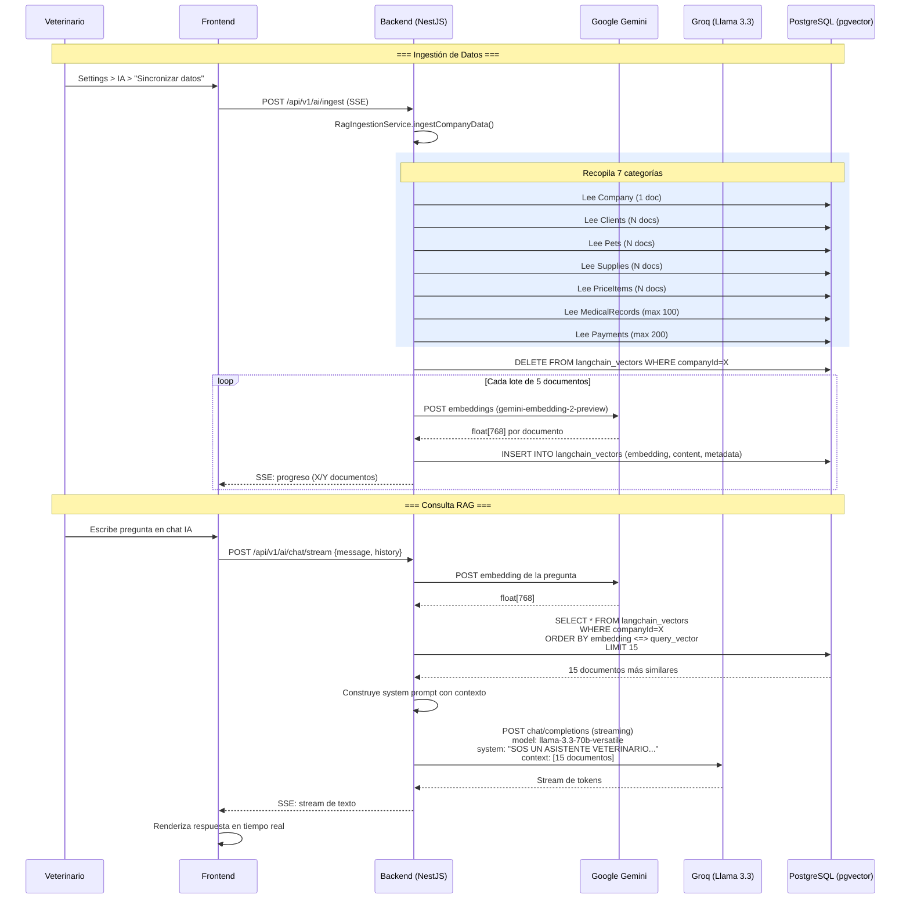
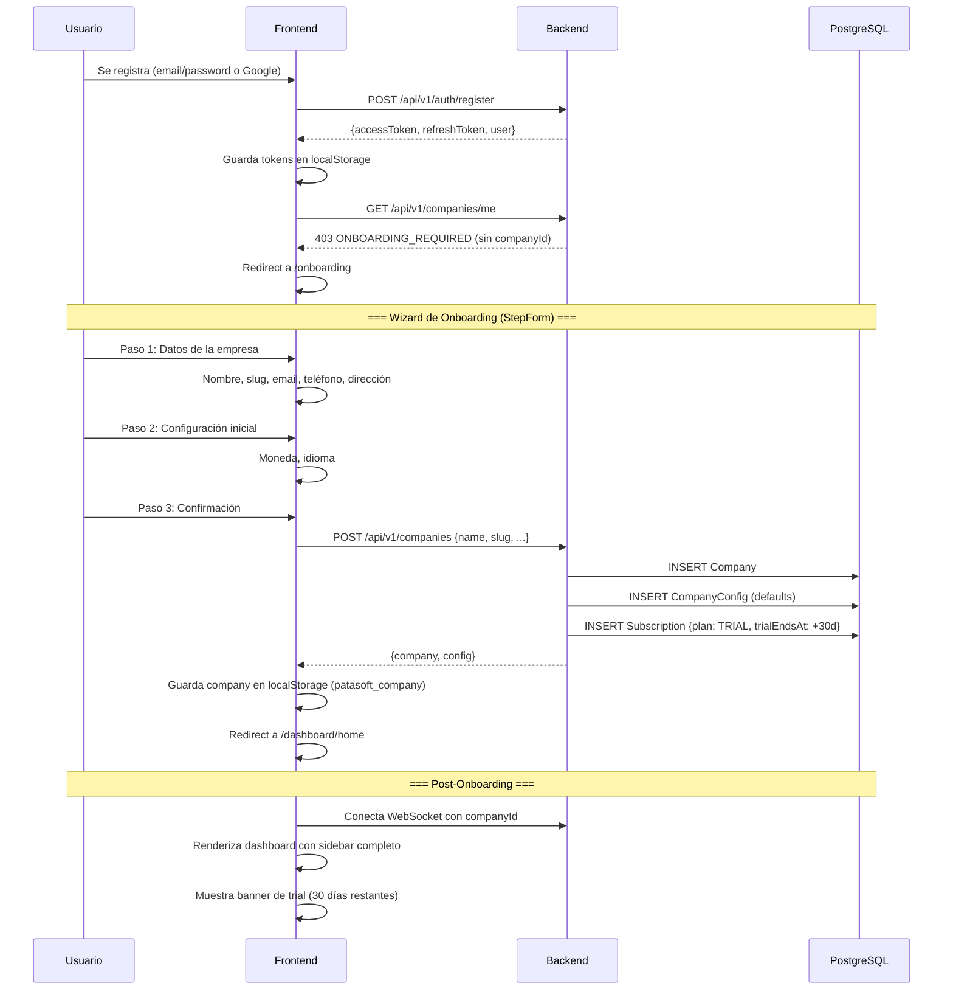
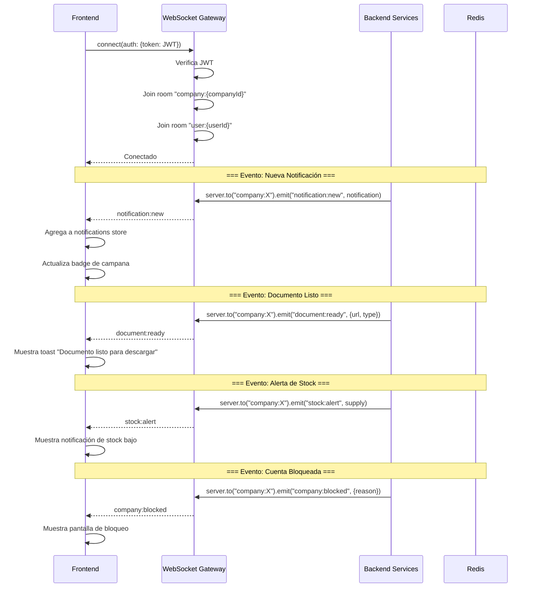

# PataSoft - Flujos de Negocio

## 1. Flujo de Autenticación

## 2. Flujo de Consulta Médica (FLUJO MÁS COMPLEJO)

## 3. Flujo de Pagos

## 4. Flujo de Suscripciones

## 5. Flujo de Deudas

## 6. Flujo RAG (Retrieval-Augmented Generation)

## 7. Flujo de Onboarding

## 8. Flujo de WebSocket (Tiempo Real)

