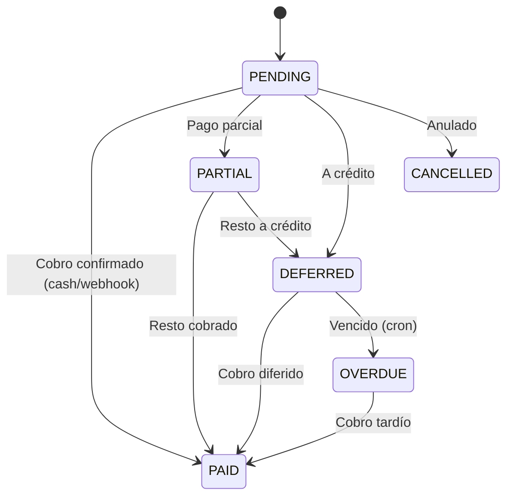
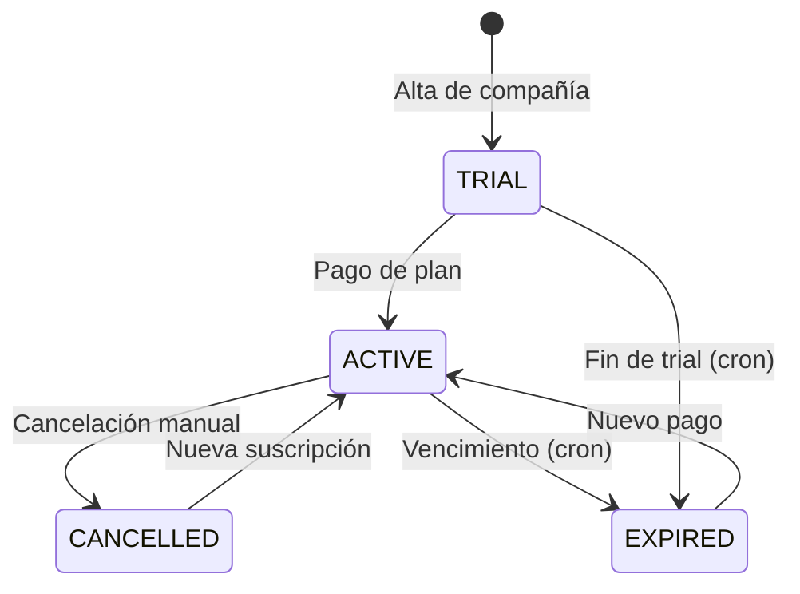

# Flujo de Pagos con MercadoPago

## Índice

1. [Introducción](#1-introducción)
2. [Flujo de Suscripción (usuario app → desarrollador)](#2-flujo-de-suscripción-usuario-app--desarrollador)
3. [Flujo de Pago de Cliente (cliente → usuario app)](#3-flujo-de-pago-de-cliente-cliente--usuario-app)
4. [Modelo de Datos](#4-modelo-de-datos)
5. [Endpoints](#5-endpoints)
6. [Verificación contra Sandbox Real](#6-verificación-contra-sandbox-real)
7. [Estados de Pago y Transiciones](#7-estados-de-pago-y-transiciones)
8. [OAuth y Conexión de Cuentas](#8-oauth-y-conexión-de-cuentas)
9. [Referencia de Código](#9-referencia-de-código)

---

## 1. Introducción

La aplicación maneja dos flujos de pago con MercadoPago:

| Flujo | Quién paga | Quién cobra | Producto |
|-------|-----------|-------------|----------|
| **Suscripción** | Usuario de la app (veterinaria) | Desarrollador (dueño de la plataforma) | Plan mensual/anual por usar el sistema |
| **Pago de cliente** | Cliente del veterinario | Usuario de la app (veterinaria) | Servicios veterinarios e insumos |

Ambos flujos usan las APIs de MP pero con cuentas receptoras diferentes:

- **Suscripción:** Usa el access token del desarrollador (configurado via env vars `MP_ACCESS_TOKEN`)
- **Pago de cliente:** Usa el access token del usuario de la app (guardado en `CompanyConfig.mpAccessToken`, puede ser OAuth)

---

## 2. Flujo de Suscripción (usuario app → desarrollador)

### Cuenta receptora

El access token es el del **desarrollador**, seteado en env var:
- `MP_ACCESS_TOKEN` — access token de la cuenta de MP del desarrollador
- `MP_PLAN_MONTHLY_PRICE` — precio del plan mensual (default `27000`)
- `MP_PLAN_YEARLY_PRICE` — precio del plan anual (default `240000`)
- `MP_SUCCESS_URL`, `MP_FAILURE_URL`, `MP_PENDING_URL` — URLs de redirect post-pago

### Endpoints

| Método | Ruta | Controlador | Servicio |
|--------|------|-------------|----------|
| `GET` | `/api/v1/subscriptions/status` | `SubscriptionsController.getStatus` | `SubscriptionsService.getStatus` |
| `POST` | `/api/v1/subscriptions/checkout` | `SubscriptionsController.createCheckout` | `SubscriptionsService.createCheckout` |
| `POST` | `/api/v1/subscriptions/webhook` | `SubscriptionsController.handleWebhook` | `SubscriptionsService.handleWebhook` |
| `POST` | `/api/v1/subscriptions/cancel` | `SubscriptionsController.cancel` | `SubscriptionsService.cancel` |
| `GET` | `/api/v1/subscriptions/success` | `SubscriptionsController.success` | — |
| `GET` | `/api/v1/subscriptions/failure` | `SubscriptionsController.failure` | — |
| `GET` | `/api/v1/subscriptions/pending` | `SubscriptionsController.pending` | — |

### Archivos

- **Controlador:** `src/subscriptions/subscriptions.controller.ts`
- **Servicio:** `src/subscriptions/subscriptions.service.ts`
- **Modelo DB:** `prisma/schema.prisma` → model `Subscription`

### Secuencia

```
Usuario App                          Backend                          MercadoPago API
    │                                    │                                │
    │  POST /subscriptions/checkout       │                                │
    │  { plan: 'MONTHLY' }               │                                │
    │────────────────────────────────────▶│                                │
    │                                    │                                │
    │                         createCheckout()                             │
    │                         src/subscriptions/subscriptions.service.ts:34│
    │                           │                                          │
    │                           │ POST /v1/preferences                    │
    │                           │─────────────────────────────────────────▶│
    │                           │◀─────────────────────────────────────────│
    │                           │  { init_point, preference_id }          │
    │                           │                                          │
    │  { initPoint, preferenceId }                                        │
    │◀────────────────────────────────────│                                │
    │                                    │                                │
    │  (Redirige al init_point)          │                                │
    │─────────────────────────────────────────────────────────────────────▶│
    │                                    │                                │
    │  (Usuario completa pago en MP)     │                                │
    │◀─────────────────────────────────────────────────────────────────────│
    │                                    │                                │
    │                                    │  POST /subscriptions/webhook    │
    │                                    │  MP envía { type: 'payment',   │
    │                                    │    data: { id: mpPaymentId } } │
    │                                    │◀────────────────────────────────│
    │                                    │                                │
    │                         handleWebhook()                              │
    │                         src/subscriptions/subscriptions.service.ts:95│
    │                           │                                          │
    │                           │ GET /v1/payments/{id}                   │
    │                           │─────────────────────────────────────────▶│
    │                           │◀─────────────────────────────────────────│
    │                           │  { status, external_reference }         │
    │                           │                                          │
    │                           │ activateSubscription()                   │
    │                           │ src/subscriptions/subscriptions.service.ts:131 │
    │                           │  - Update subscription en DB             │
    │                           │  - company.isBlocked = false             │
    │                           │                                          │
```

### Detalle del Servicio

#### `SubscriptionsService.createCheckout(companyId, dto)` — línea 34

1. Busca `Company` + `CompanyConfig` (para validar que existe)
2. Busca `Subscription` existente de la compañía
3. Calcula precio según `dto.plan`:
   - `'MONTHLY'` → `process.env.MP_PLAN_MONTHLY_PRICE` (27000)
   - `'YEARLY'` → `process.env.MP_PLAN_YEARLY_PRICE` (240000)
4. Crea preferencia en MP:
   - `POST https://api.mercadopago.com/v1/preferences`
   - Body: `items[{ title, quantity, unit_price }]`, `back_urls[success, failure, pending]`, `external_reference: JSON.stringify({ type:'subscription', companyId, plan })`, `notification_url: https://api-patasoft.artisandevs.site/api/v1/subscriptions/webhook`
   - Auth: `Bearer ${MP_ACCESS_TOKEN}`
5. Retorna `{ initPoint, preferenceId }`

#### `SubscriptionsService.handleWebhook(data, signature?, requestId?)` — línea 95

1. Valida `data.type === 'payment'` y `data.data.id` existe
2. Busca el payment en MP: `GET /v1/payments/{paymentId}`
3. Extrae `external_reference` → parsea JSON → obtiene `type`, `companyId`, `plan`
4. Si `status === 'approved'` → `activateSubscription(companyId, plan)`
5. Retorna `{ received: true }`

#### `SubscriptionsService.activateSubscription(companyId, plan)` — línea 131

- Actualiza `Subscription`: `plan`, `status: 'ACTIVE'`, `expiresAt` (30 días si MONTHLY, 365 si YEARLY, desde ahora), `trialEndsAt: null`
- Actualiza `Company`: `isBlocked: false`
- Si es YEARLY, incorpora lógica de descuento (código en línea ~160)

#### `SubscriptionsService.getStatus(companyId)` — línea 22

Retorna:
- `{ active: true, plan, expiresAt, daysRemaining }` si subscription activa y no expirada
- `{ active: false, reason: 'TRIAL' | 'EXPIRED' | 'NONE' }` en caso contrario

### Modelo `Subscription` (`prisma/schema.prisma`)

```prisma
model Subscription {
  id          String            @id @default(cuid())
  companyId   String            @unique
  plan        SubscriptionPlan  // TRIAL | MONTHLY | YEARLY
  status      SubscriptionStatus // ACTIVE | CANCELLED | EXPIRED | TRIAL
  expiresAt   DateTime?
  trialEndsAt DateTime?
  createdAt   DateTime          @default(now())
  updatedAt   DateTime          @updatedAt
  cancelledAt DateTime?
  company     Company           @relation(fields: [companyId], references: [id], onDelete: Cascade)
}
```

---

## 3. Flujo de Pago de Cliente (cliente → usuario app)

### Cuenta receptora

El access token es del **usuario de la app** (la veterinaria), almacenado en:
- `CompanyConfig.mpAccessToken` — access token directo (para cuentas sin OAuth)
- O via OAuth: `CompanyConfig.mpOAuthToken`, `mpOAuthRefreshToken`, `mpOAuthExpiresAt`

### Servicio Central

`src/mercadopago/mercadopago.service.ts` — `MercadopagoService`

Este servicio es el **cerebro** de la integración con MP. Lo usan tanto `PaymentsService` como `SubscriptionsService`.

### Archivos

- **Servicio MP:** `src/mercadopago/mercadopago.service.ts`
- **Controlador MP:** `src/mercadopago/mercadopago.controller.ts`
- **Servicio Pagos:** `src/payments/payments.service.ts`
- **Controlador Pagos:** `src/payments/payments.controller.ts`

### Modalidades de Pago

| Modalidad | Endpoint | Descripción |
|-----------|----------|-------------|
| **MP_CHECKOUT** | `POST /api/v1/payments/:id/checkout` | Link de pago para enviar al cliente |
| **MP_QR** | `POST /api/v1/mercadopago/qr` | QR para cobro presencial |

### Secuencia MP_CHECKOUT

```
App Backend                    MercadoPago API
    │                                │
    │  POST /payments/:id/checkout   │
    │──────────────────────────────▶ │  createCheckoutLink()
    │                                │  src/payments/payments.service.ts:223
    │                                │    → mercadopagoService.createPreference()
    │                                │    → src/mercadopago/mercadopago.service.ts:23
    │                                │
    │                        POST /v1/preferences
    │─────────────────────────────────────────────▶
    │◀─────────────────────────────────────────────
    │         { init_point, preference_id }
    │
    │  Retorna initPoint, preferenceId
    │◀──────────────────────────────
    │
Cliente recibe link → abre → paga en MP
    │                                │
    │                                │  POST /api/v1/payments/webhook
    │                                │  ?topic=payment&id=MP_ID
    │◀───────────────────────────────│
    │                                │
    │  handleWebhook(topic, id)      │
    │  src/mercadopago/mercadopago.service.ts:198
    │    ├── GET /v1/payments/{id}
    │    ├── Si status === 'approved':
    │    │   ├── Busca Payment por external_reference
    │    │   ├── Payment → PAID, paidAt, mpPaymentId
    │    │   ├── Debt → PAID si existe
    │    │   ├── CashMovement (INCOME)
    │    │   ├── generateAndStoreReceipt()
    │    │   └── WebSocket emit 'payment:confirmed'
    │    └── Si status ≠ approved:
    │        └── Log, no action
    │
```

### Detalle: MercadopagoService.createPreference() — línea 23

```
createPreference(companyId, dto: CreatePreferenceDto)
│
├── 1. Obtener access token:
│   ├── Usa token de CompanyConfig (puede ser OAuth)
│   └── Si expiró → refreshOAuthToken()
│
├── 2. Obtener mpUserId de CompanyConfig
│
├── 3. POST /v1/preferences
│   Body: {
│     items: [{ title, quantity, unit_price }],
│     payer: { email: client.email },
│     external_reference: dto.externalReference || payment.id,
│     notification_url: `${BACKEND_URL}/api/v1/payments/webhook`,
│     metadata: { companyId }
│   }
│
└── 4. Retorna { initPoint, preferenceId }
```

### Detalle: MercadopagoService.createQrPayment() — línea 82

```
createQrPayment(companyId, dto: QrPaymentDto)
│
├── 1. Obtener access token + mpUserId
├── 2. ensurePosExists() — crea punto de venta en MP si no existe
├── 3. POST /v1/orders (QR order)
│     └── title, transaction_amount, items, external_reference
└── 4. Retorna { qrData, orderId }
```

### Detalle: MercadopagoService.handleWebhook() — línea 198

```
handleWebhook(topicOrType, id)
│
├── 1. GET /v1/payments/{id} para obtener datos del pago
│
├── 2. Según external_reference:
│   ├── Si es JSON con type:'subscription' → subscriptionsService.activateSubscription()
│   └── Si es un paymentId → procesa pago de cliente
│
├── 3. Para pago de cliente (líneas 228-290):
│   ├── Busca Payment por external_reference
│   ├── Si status === 'approved':
│   │   ├── Payment.status = 'PAID'
│   │   ├── Payment.paidAmount = transaction_amount
│   │   ├── Payment.paidAt = now
│   │   ├── Payment.mpPaymentId = id de MP
│   │   ├── Debt → status PAID si existe
│   │   ├── CashMovement (INCOME)
│   │   └── generateAndStoreReceipt() (sin await)
│   └── Actualiza Payment en DB
│
└── 4. Retorna { received: true }
```

---

## 4. Modelo de Datos

### CompanyConfig

`prisma/schema.prisma` — modelo `CompanyConfig` (líneas ~39-60)

```prisma
model CompanyConfig {
  id                String    @id @default(cuid())
  companyId         String    @unique
  mpAccessToken     String?   // Token directo de MP (para cuentas sin OAuth)
  mpUserId          String?   // ID de usuario en MP
  mpPublicKey       String?   // Public key para el frontend
  mpOAuthToken      String?   // Token OAuth
  mpOAuthRefreshToken String? // Refresh token OAuth
  mpOAuthExpiresAt  DateTime? // Expiración del token OAuth
  mpPosId           String?   // ID del punto de venta en MP (para QR)
  mpStoreId         String?   // ID de la tienda en MP
  // ...
}
```

### Payment (para pagos de cliente)

Ver `docs/documents_flow.md` → sección 4 para el detalle del modelo `Payment`.

---

## 5. Endpoints

### SubscriptionsController (`src/subscriptions/subscriptions.controller.ts`)

Ruta base: `api/v1/subscriptions`

| Método | Ruta | Auth | Handler | Descripción |
|--------|------|------|---------|-------------|
| `GET` | `/status` | JWT | `getStatus` | Ver estado de suscripción actual |
| `POST` | `/checkout` | JWT | `createCheckout` | Crear link de pago de suscripción |
| `GET` | `/success` | Público | `success` | Redirect post-pago exitoso |
| `GET` | `/failure` | Público | `failure` | Redirect post-pago fallido |
| `GET` | `/pending` | Público | `pending` | Redirect post-pago pendiente |
| `POST` | `/webhook` | Público | `handleWebhook` | Webhook de MP para suscripciones |
| `POST` | `/cancel` | JWT | `cancel` | Cancelar suscripción |

### MercadopagoController (`src/mercadopago/mercadopago.controller.ts`)

Ruta base: `api/v1/mercadopago`

| Método | Ruta | Auth | Handler | Descripción |
|--------|------|------|---------|-------------|
| `POST` | `/preference` | JWT | `createPreference` | Crear preferencia de pago |
| `POST` | `/qr` | JWT | `createQrPayment` | Generar QR para pago presencial |
| `POST` | `/webhook` | Público | `handleWebhook` | Webhook de MP para pagos de cliente |
| `GET` | `/status/:mpPaymentId` | JWT | `getPaymentStatus` | Consultar estado de pago en MP |
| `GET` | `/oauth/connect` | JWT | `connectOAuth` | Iniciar OAuth con MP |
| `GET` | `/oauth/callback` | JWT | `handleOAuthCallback` | Callback OAuth de MP |
| `DELETE` | `/oauth/disconnect` | JWT | `disconnectOAuth` | Desconectar cuenta MP |
| `GET` | `/oauth/status` | JWT | `getOAuthStatus` | Ver estado OAuth |

### PaymentsController (endpoints relacionados con MP)

| Método | Ruta | Auth | Handler | Descripción |
|--------|------|------|---------|-------------|
| `POST` | `/api/v1/payments/:id/checkout` | JWT | `generateCheckoutLink` | Crear link MP para pago de cliente |
| `POST` | `/api/v1/payments/webhook` | Público | `handleWebhook` | Webhook MP (delega a MercadopagoService) |

---

## 6. Verificación contra Sandbox Real

### Estado actual: ✅ 11/11 tests pasando contra sandbox real

**Archivo de test:** `test/integration/mp-sandbox-verify.e2e-spec.ts`

### Lo que se probó

#### Flow 1: Subscription (3 tests contra MP real)

| Test | Descripción | Resultado |
|------|-------------|-----------|
| 1.1 | Crear preferencia de suscripción en MP API | ✅ init_point real devuelto |
| 1.2 | init_point accesible (HTTP reachable) | ✅ Status 301-308 |
| 1.3 | Crear pago aprobado via API con tarjeta test (bypass browser) | ✅ status=approved, payment ID real |
| 1.4 | Verificar payment en MP API: external_reference coincide | ✅ Contiene "subscription" |
| 1.5 | Webhook local procesa pago real → DB actualizada | ✅ Subscription a MONTHLY, expiresAt > now |

#### Flow 2: Client Payment (3 tests contra MP real)

| Test | Descripción | Resultado |
|------|-------------|-----------|
| 2.1 | Crear pago en DB (método MP_CHECKOUT) | ✅ Payment creado |
| 2.2 | Crear checkout link via MercadopagoService real | ✅ init_point real |
| 2.3 | init_point accesible | ✅ |
| 2.4 | Crear pago aprobado via API (bypass browser) | ✅ status=approved |
| 2.5 | Verificar payment en MP API: external_reference = paymentId | ✅ Coincide |
| 2.6 | Webhook procesa pago real → DB actualizada | ✅ Payment=PAID, cashMovement INCOME |

### Coverage total

- **247 tests unitarios** — todos pasando
- **23 tests E2E con mock de fetch** — subscriptions (8) + payments (15)
- **11 tests contra sandbox REAL** — subscriptions (5) + client payments (6)
- **Total: 281 tests, 0 fallos**

### Cómo se evitó browser automation

En vez de usar Puppeteer para navegar el checkout de MP (que fallaba por iframes cross-origin), se crean pagos aprobados via API directa:

1. `POST /v1/card_tokens` con tarjeta de test Mastercard `5031 7557 3453 0604`
2. `POST /v1/payments` con ese token + `external_reference` + `X-Idempotency-Key`
3. En sandbox, estos pagos se auto-aprueban con `status: approved`

### Comando para ejecutar

```bash
MP_TEST_TOKEN=TEST-xxx npx vitest run --config vitest.e2e.config.ts \
  test/integration/mp-sandbox-verify.e2e-spec.ts
```

---

## 7. Estados de Pago y Transiciones

### Payment (pago de cliente)



### Subscription (suscripción de la app)



### Lógica de vencimientos (cron)

En `src/cron/cron.service.ts` — se ejecuta diariamente a las **10:00 AM**:
- `checkExpirations()`: busca suscripciones EXPIRED o en TRIAL vencidas y bloquea la compañía (`isBlocked: true`)
- `DebtsService.processAlerts()` a las **8:00 AM**: marca deudas vencidas como OVERDUE, emite alertas

### Guard de suscripción

`src/auth/guards/jwt-auth.guard.ts` — verifica que la compañía del usuario tenga:
- Una suscripción activa (`status: ACTIVE` o `TRIAL`)
- Fecha de expiración no vencida
- `company.isBlocked === false`

Si no, rechaza la request con `402 Payment Required`.

---

## 8. OAuth y Conexión de Cuentas

Para que los usuarios de la app puedan recibir pagos de sus clientes via MP, necesitan conectar su cuenta de MP. Esto se hace via OAuth.

### Flujo OAuth

```
Usuario App → GET /api/v1/mercadopago/oauth/connect
  → Redirige a MP: https://auth.mercadopago.com/authorization?client_id=...&redirect_uri=...
  → Usuario autoriza en MP
  → MP redirige a: GET /api/v1/mercadopago/oauth/callback?code=...
  → handleOAuthCallback(): intercambia code por access_token + refresh_token
  → Guarda en CompanyConfig: mpOAuthToken, mpOAuthRefreshToken, mpOAuthExpiresAt
```

### Refresh automático

En `MercadopagoService` (línea 126, función interna `makeRequest`):
- Cada request a MP se hace con el token vigente
- Si responde 401 → `refreshOAuthToken(companyId)` → obtiene nuevo token → reintenta request

---

## 9. Referencia de Código

### Archivos principales

| Archivo | Rol |
|---------|-----|
| `src/mercadopago/mercadopago.service.ts` | Servicio central: createPreference, createQrPayment, handleWebhook, OAuth |
| `src/mercadopago/mercadopago.controller.ts` | Endpoints de MP: preferencia, QR, webhook, OAuth |
| `src/subscriptions/subscriptions.service.ts` | Lógica de suscripciones: checkout, webhook, activate, cancel, checkExpirations |
| `src/subscriptions/subscriptions.controller.ts` | Endpoints de suscripción |
| `src/payments/payments.service.ts` | Lógica de pagos de cliente: create, update, handleWebhook, generateReceipt |
| `src/payments/payments.controller.ts` | Endpoints de pagos |
| `src/cron/cron.service.ts` | Tareas programadas: alertas de deuda, verificación de suscripciones |
| `src/auth/guards/jwt-auth.guard.ts` | Guard que verifica suscripción activa |
| `prisma/schema.prisma` | Modelos: Payment, Subscription, CompanyConfig, Debt, CashMovement |

### Líneas clave en MercadopagoService

| Método | Línea | Descripción |
|--------|-------|-------------|
| `createPreference()` | 23 | Crea preferencia de pago en MP |
| `createQrPayment()` | 82 | Genera orden QR en MP |
| `makeRequest()` (interna) | 126 | Wrapper con refresh OAuth automático |
| `ensurePosExists()` | 171 | Crea punto de venta en MP |
| `handleWebhook()` | 198 | Procesa webhooks de MP |
| `getPaymentStatus()` | 310 | Consulta estado de pago en MP |
| `handleOAuthCallback()` | 322 | Intercambia code OAuth por tokens |
| `refreshOAuthToken()` | 366 | Refresca token OAuth vencido |
| `disconnectOAuth()` | 398 | Desconecta cuenta MP |
| `getOAuthStatus()` | 412 | Retorna estado de conexión OAuth |

### Líneas clave en SubscriptionsService

| Método | Línea | Descripción |
|--------|-------|-------------|
| `getStatus()` | 22 | Retorna estado de suscripción |
| `createCheckout()` | 34 | Crea preferencia de suscripción en MP |
| `handleWebhook()` | 95 | Procesa webhook de suscripción |
| `activateSubscription()` | 131 | Activa plan en DB |
| `cancel()` | 176 | Cancela suscripción |
| `checkExpirations()` | 189 | Cron: marca suscripciones vencidas |

### Líneas clave en PaymentsService

| Método | Línea | Descripción |
|--------|-------|-------------|
| `create()` | 66 | Crear pago directo con desc. stock, debt, receipt |
| `update()` | 141 | Actualizar pago (PAID → cash movement, receipt) |
| `generateCheckoutLink()` | 223 | Crear link MP para pago |
| `generateReceipt()` | 228 | Generar recibo PDF |
| `handleWebhook()` | 232 | Webhook MP (delega a MercadopagoService) |
